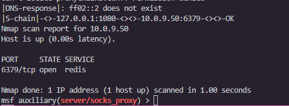

# 🕵️ Lab Report: The Deep Network (Pivot Operation)

## 🎯 **Objective**
The primary objective of this operation was to demonstrate **Lateral Movement** and **Persistence** within a multi-tier enterprise network. The mission required compromising a public-facing Web Server and leveraging it as a "pivot point" to reach a sensitive Database Server located on a completely isolated, air-gapped private subnet (10.0.9.0/24).

---

## 🛠️ **Technical Stack & Toolset**
* **Host Environment:** Ubuntu VM (Attacker Machine)
* **Infrastructure:** Dockerized Multi-Tier Network (CloudNano)
* **Persistence:** Linux Crontab, Bash Reverse Shells, Netcat
* **Exploitation/Pivoting:** Metasploit Framework (MSF), Meterpreter
* **Network Intelligence:** SOCKS4a Proxy, Proxychains, Nmap
* **Version Control:** Git/GitHub

---

## 🚀 **The Kill Chain: Step-by-Step Execution**

### **Phase 1: Establishing the Foothold (Persistence)**
1.  **Initial Breach:** Leveraged compromised credentials to SSH into `Web-Server-01` (172.50.0.10).
2.  **The Sabotage:** Modified the system's `crontab` to execute a hidden bash payload every 60 seconds.
3.  **Automation:** Verified that the server initiated an outbound connection back to my local listener (`nc -lvnp 4444`) automatically, ensuring access survives a system reboot.

### **Phase 2: The Deep Dive (Lateral Movement)**
1.  **Metasploit Integration:** Upgraded the shell to a **Meterpreter session** to handle complex networking tasks.
2.  **The Pivot:** Configured an **autoroute** within Metasploit, mapping the path to the hidden 10.0.9.0/24 subnet through the compromised web server.
3.  **The Tunnel:** Deployed a **SOCKS proxy** on the attacker machine to "bridge" external tools into the internal tunnel.
4.  **Final Discovery:** Orchestrated a `proxychains` Nmap scan to reveal the **Redis port (6379)** on the hidden database host (`10.0.9.50`).

---

## 🔧 **Troubleshooting & Digital Forensics Log**

| **Challenge Encountered** | **Root Cause** | **Strategic Resolution** |
| :--- | :--- | :--- |
| **SSH Host Mismatch** | Environment refresh changed the server's RSA fingerprint. | Used `ssh-keygen -R` to purge the old host identity from `known_hosts`. |
| **Command Not Found (Cron)** | Target container was a "minimal" OS build missing core utilities. | Performed a manual `apt update && apt install cron nano` as root. |
| **Inactive Shell Timer** | The Cron service was installed but not initialized in the daemon list. | Executed `service cron start` to manually trigger the task scheduler. |
| **Proxy Connection Denied** | SOCKS proxy became "stale" after the route table was updated. | Performed a `jobs -K` in MSF and restarted the proxy to sync the handshake. |

---

## 🧠 **Key Learning Outcomes**
* **Network Segmentation:** Visualized how dual-homed servers act as gateways between public and private zones.
* **Egress Mastery:** Demonstrated how **Reverse Shells** exploit "lazy" outbound firewall rules to maintain access.
* **Pivoting Logic:** Mastered the coordination between **Routing** (internal MSF logic) and **Proxying** (external tool integration).
* **Operational Resilience:** Developed the "Digital Detective" mindset—viewing technical roadblocks as data points for further investigation.

---

## 📊 **Final Evidence (Artifact)**

### **Proof of Lateral Movement**
The screenshot below confirms the successful scan of the hidden database. It displays the `proxychains` routing path through `127.0.0.1:1080` and the discovery of the open **Redis port 6379** on the target `10.0.9.50`.

---

### **Commit History**
`git commit -m "feat: W8 | S24 | Pivot operation — hidden network scanned"`